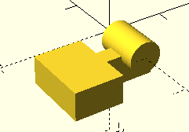
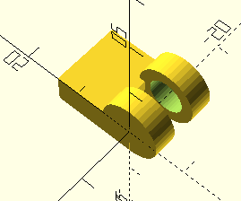
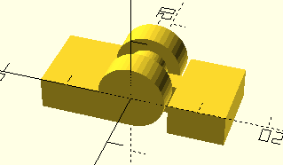
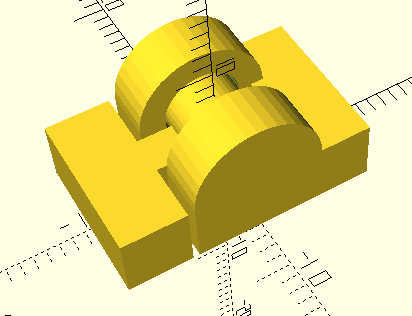

# Hinge Experiments

Trying out some print-in-place hinges.

First experiment was with concentric cylinders. With the male cylinder on the inside and the female cylinder on the outside edges.

I tried printing them vertically with the hinge in closed position, and then tried on it's side in open position.

Both technically worked, but I think the vertical hinge doesn't really make sense. The 3d printer has to start a floating cylinder in the air hovering above the enclosure, whereas the flaps laying on the plate can support the floating cylinder.

## Version 2

Made some small improvements.

