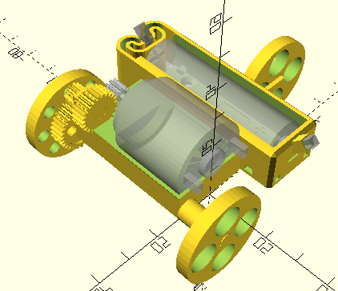

# Motor Car

This uses a [Sparkfun Hobby Motor - Gear](https://www.sparkfun.com/hobby-motor-gear.html) connected directly to a AA battery to drive geared down wheels.

The motor comes with a 10 tooth 0.5 module gear. I connect that to a 24 tooth gear and then to a 10x31 tooth gear down. Thats a combined ratio of 1:7.44. So it's 7.44x more torque and 1/7.44 the rotational speed.

The motor also comes with jumper wires, so made slots in the battery holder to easily insert them.

## Printing Instructions

Works fine with PLA. Supports not necessary. If you enable supports, it's annoying to dig them out of the long hole in the frame.

## Assembly

* the motor fits into the frame usually fits snugly.
* gear1 connects to gear2 through a hole. The hole might be a little tight, so you might want to dig that out to loosen it.
* after connecting driveShaft and driveWheel through the long frame hole, glue the driveWheel to the shaft so it doesn't fall off.

## Common Issues

* The large flat surface against the print bed can curl and lift up. I've textured the bottom, but sometimes the battery holder still curls up by the spring.
* The drive shaft snaps off where it connects to the gear. Maybe it would be better with more infill? Or with a micro-trench around the shaft? Or print the shaft in a separate part horizontally and glue the other side as well?
* The battery holder spring has no springiness when you print it with PLA. But it works fine anyway.

