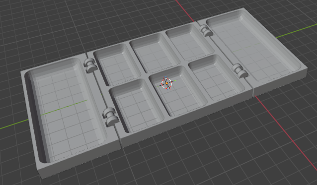
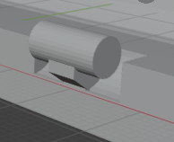
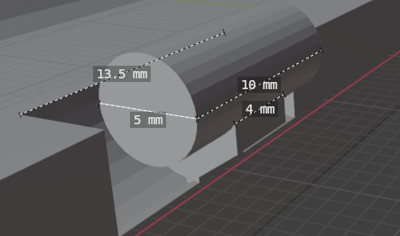
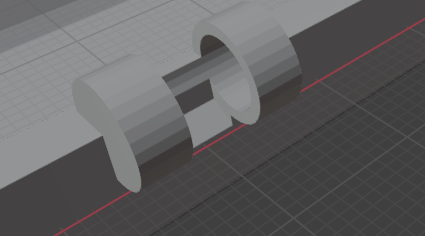
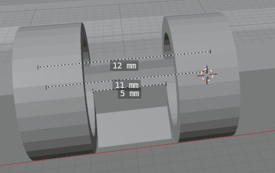
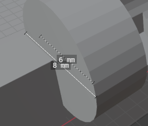

# Foldable Paint Tray

The hinge is a similar design to the openscad one in the hinge-experiments folder, but designed in blender instead of openscad.

## Hinge Design

### Pin and Inside knuckle

### Hinge Caps

