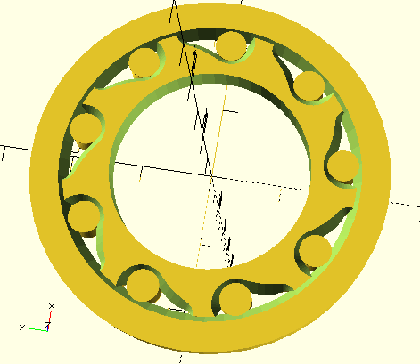

# Roller Free Wheel One-Way Clutch

This is my attempt at designing a one-way clutch as an alternative to a ratchet.

The roller one-way clutch shoves rollers into a narrow space between the inner wheel and the outer housing to make them jam when rotated in one direction, and releases it when rotated the other direction.

The roller basically has two positions, the locked position and the unlocked position. The unlocked position has a large enough radius to allow the roller to spin freely as the roller slides toward the locked position, the hole pushes it towards the outer housing to try to jam it in place. A shallower angle makes it easier for the roller to jam. If the roller slips backwards or slides then torque can't be transferred. Having many rollers increases the likelihood that one of them will successfully jam and makes it so the center wheel is pushed towards the center from all directions at once.