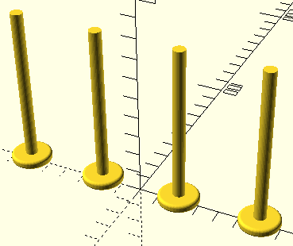
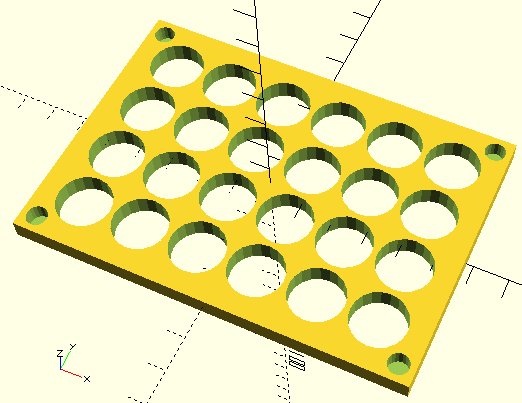
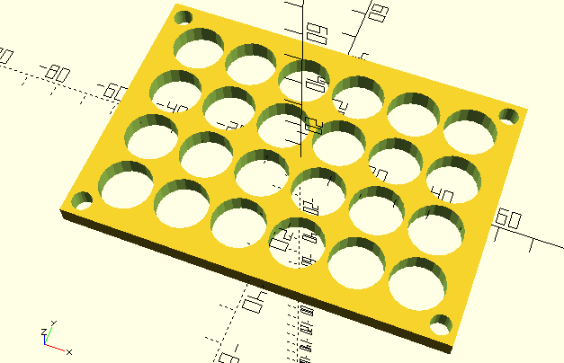

# Straw Rack

This is a rack for large straws for drying them after washing. The design is split up into three models, the top rack, the bottom rack, and the legs.

## Legs

The legs are 80mm tall and have rounded feet.

## Rack Top

The rack is 4x6 holes with 8mm radius, and partial holes at the corners for the feet with 3mm radius.

## Rack Bottom

Rack bottom is same as the top, but the leg hole are all of the way through.